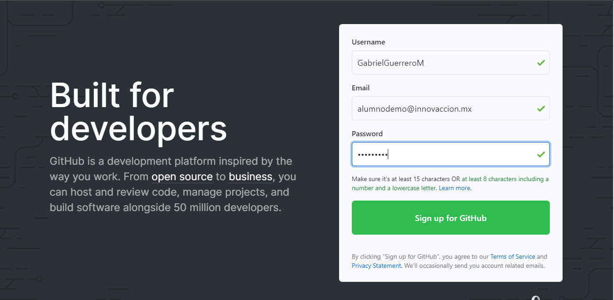
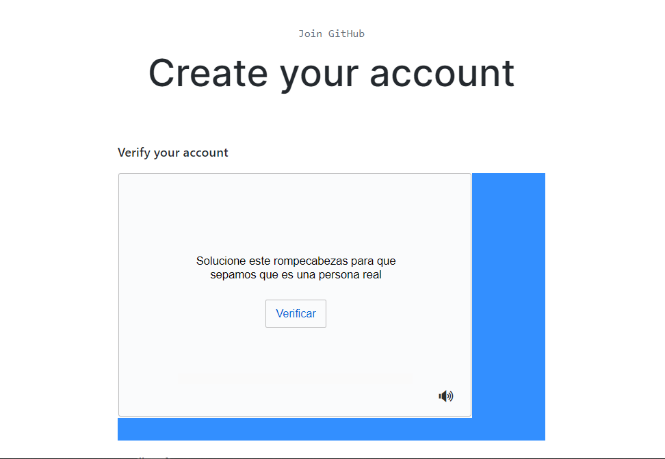
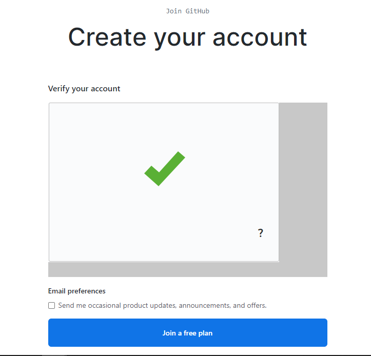
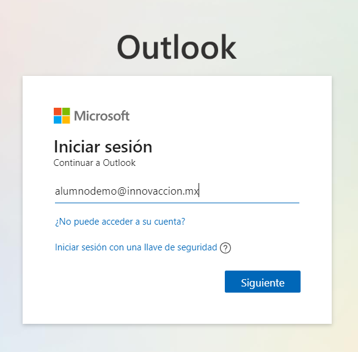
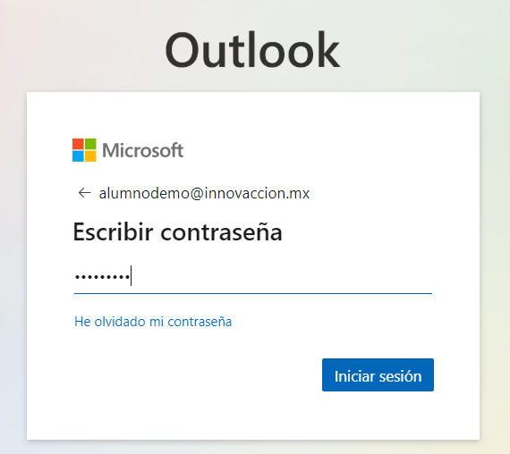
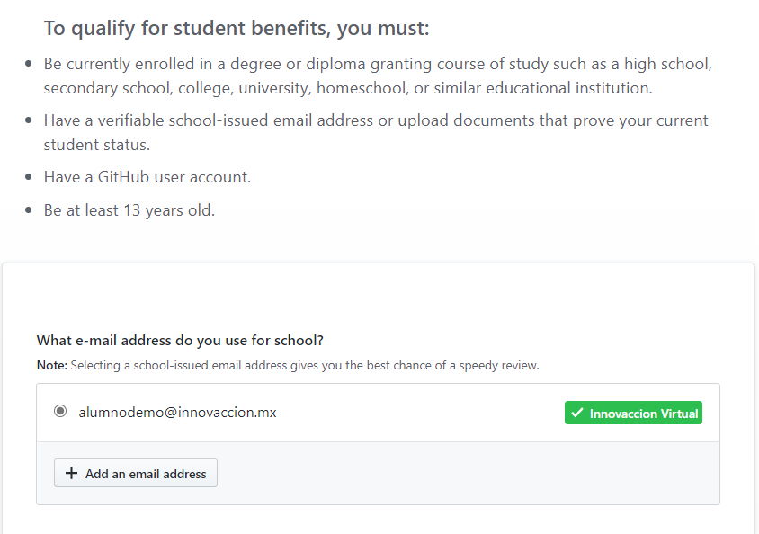
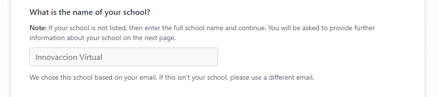
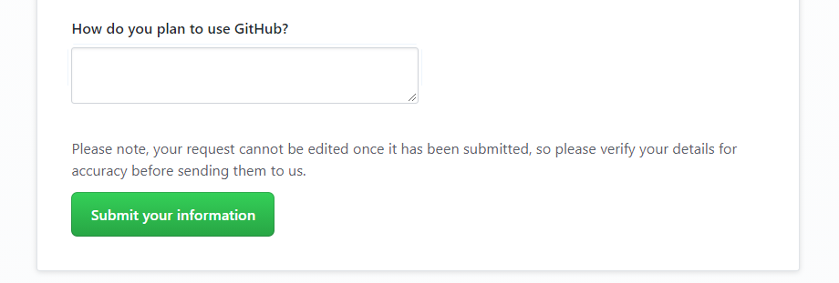
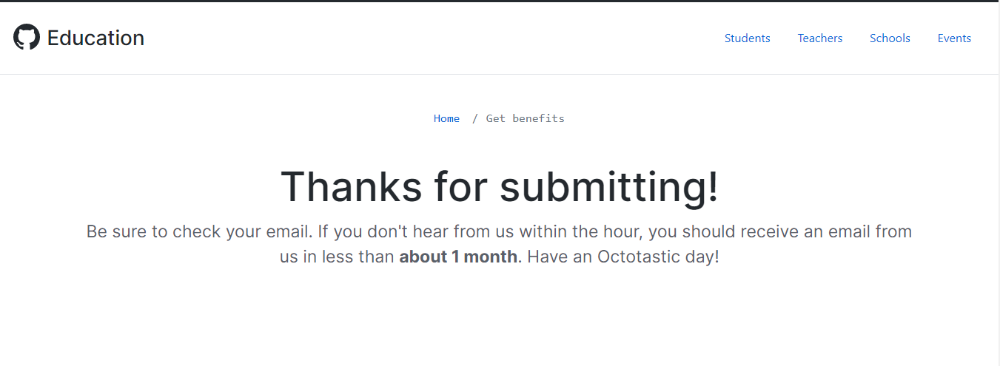

# Onboarding Innovacción Virtual - GitHub Student Developer Pack

### Bienvenido al ciclo de Innovacción Virtual de Microsoft.
  

Como parte de los beneficios del programa se encuentra el acceso al  **GitHub Student Developer Pack** 

### GitHub Student Developer Pack

    

Un conjunto de herramientas, cursos y programas de comunidad con un valor aproximado de 200 mil dólares anuales, que te ayudarán a fortalecer los conocimientos que irás adquiriendo durante tu viaje por Innovacción Virtual. 

Es decir, como tus Sherpas Digitales, tenemos para ti una mochila virtual con todos los elementos necesarios para que puedas afrontar tus retos, terminar el programa y seguir en constante desarrollo. Incluso, cuando el ciclo haya finalizado.

### ¿Cómo Funciona?

Para poder acceder a los beneficios del GitHub Student Developer Pack, es necesario contar con una cuenta institucional de tu Universidad, así cómo un documento que acredite tu status de estudiante. 

Sin embargo al ingresar al programa de Innovacción Virtual 
En este repositorio encontrarás las instrucciones para poder activar tu GitHub Student Developer Pack, haciendo uso de tu cuenta de Innovacción Virtual.

### ¿Qué necesito?

Para poder acceder a los beneficios que otorga el GitHub Student Developer Pack es necesario:

* Contar con una cuenta de **estudiante (Tu cuenta de Innovacción Virtual)**.
* Tener mínimo 13 años de edad.
* Contar con una cuenta de **GitHub (Si no tienes, te enseñamos a hacer una)**.

### ¿Cuáles son los pasos para acceder al GitHub Student Developer Pack?

* [Crear una cuenta de GitHub](#creando-una-cuenta-de-github)
* [Verificar la cuenta de GitHub](#verificar-la-cuenta-de-correo-en-github)
* [Activar el GitHub Student Developer Pack](#activando-el-student-developer-pack)

## Creando una cuenta de GitHub

Ingresa a la página de [GitHub](https://github.com/) y rellena los campos que a continuación te solicitan con la siguiente información:


**Username:** Un nombre de Usuario con el que serás identificado, te recomendamos escoger un nombre corto, puede ser algo como ```NombreApellido```. Si no está disponible puedes agregar, la letra de tu segundo apellido, un numero o algún distintivo.
Ejemplo: 
* ```RodolfoFerro``` 
* ```FernandaOchoa```

**Correo:** **Tu correo de Innovacción Virtual, termina con @innovaccion.mx**  
**Contraseña:** Asegúrate de guardar en un lugar seguro tu contraseña, ya que la necesitarás en varias ocasiones al usar GitHub.

Una vez terminado el proceso deberás tener algo como lo que se muestra a continuación.



Ahora procedemos a dar clic en **Sign up for GitHub** 

Nos pedirá verificar que no somos un robot el que está intentando acceder, tendremos una pantalla similar. Basta con dar clic en Verificar, nos pedirá hacer Identificar un elemento en una imagen, etc.



Al terminar la verificación damos se mostrará una palomita verde y damos clic en **Join a Free Plan**



A continuación tendremos que seleccionar de una serie de opciones, aquellas con las que nos identifiquemos. Por ejemplo, Estudiante.


También podremos seleccionar el nivel de experiencia que tenemos en programación de software. 
* **None**: Nunca he programado nada
* **A little**: Voy iniciando en la programación
* **A moderater amount**: Tengo un poco de experiencia previa.
* **A lot**: Tengo mucha experiencia previa.

 

Posteriormente, nos pregunta ¿Para qué queremos utilizar GitHub?, Podemos seleccionar hasta 3 opciones.
Entre las opciones se encuentran:

* Aprender a Programar
* Aprender Git y GitHub
* Crear un repositorio (Almacenar un projecto)

* Crear una página web con GitHub WebPages
* Para colaborar entre equipos
* Encontrar o contribuir a un proyecto open source

* Para trabajar en proyectos escolares
* Consumir el API de GitHub
* Otro


Finalmente nos pregunta acerca de nuestros intereses, igualmente podemos escribir algunos. 
Por ejemplo: Lenguajes de programación, algún Framework o Industria. 


Al dar enter nos mostrará la siguiente pantalla, informando que debemos verificar nuestra cuenta de correo.


## Verificar la Cuenta de Correo en GitHub

Para verificar nuestra cuenta de correo, debemos seguir estos pasos:

* Ingresar a la siguiente dirección ```https://outlook.office365.com/``` o dar [clic aquí](https://outlook.office365.com/) 

* Nos pedirá nuestra cuenta de correo, por lo que escribimos nuestra cuenta de **Innovacción Virtual **
        @innovaccion.mx
      

* Al dar clic en siguiente nos pedirá nuestra contraseña de la cuenta de correo. 
    *   

* Tendremos en nuestra bandeja de entrada un nuevo correo electrónico de GitHub le damos clic para abrirlo.  
    * 

* El correo es el siguiente, damos clic en **Mostrar contenido bloqueado**
    * 

* Clic en **Verify email address**
    * 

* Automáticamente nos abrirá una nueva ventana con el mensaje de que ha sido verificada nuestra cuenta
    * 
    
* En nuestra bandeja de entrada tendremos un correo con la verificación exitosa.
      


## Activando el Student Developer Pack

Ahora que ya tenemos un correo y la cuenta de GitHub podemos aplicar para el GitHub Student Developer Pack.

* Ingresamos al siguiente link: [Aquí](https://education.github.com/discount_requests/student_application?utm_source=2020-09-14-InnovaccionVirtual)

* Nos mandará a nuestro formulario de aplicación al GitHub Student Developer Pack
    * 

* Como podemos observar el link que te proporcionamos aquí esta pre-aprobado directamente.
    * 

* Más abajo ya se encuentra por defecto **Innovacción Virtual** como el nombre de nuestra escuela.
    * 

* Sólo debemos escribir **En Inglés**, Cómo planeamos utilizar nuestro Student Developer Pack. 
    * Podemos mencionar cosas como: Aprender a desarrollar nuevos proyectos, almacenar los proyectos que desarrollas, etc.
    
    * 
    
* Al finalizar, damos clic en Submit your information y tendremos la confirmación de envio.

    * 
    
* Recibiremos un email en un lapso de 1 hora a 3 dias hábiles. En este caso, llego en 5 min al apartado de otros. Le doy clic a **Otros: nuevas conversaciones**

    * 
    
* Tendremos algo así
    * 

* Abrimos el correo y con esto, hemos activado exitosamente nuestro GitHub Student Developer Pack
    * 
    
