# Inducción Innovacción Virtual

## Objetivos 🥅

Al finalizar este módulo deberás de tener: 
- Una cuenta de GitHub.
- Acceso al GitHub Student Developer Pack.
- Acceso a la organización.

*Si ya tienes activado tu GitHub Student Developer Pack, salta al paso #4.*

## GitHub Student Developer Pack

    

No hay sustituto para la experiencia práctica. Pero para la mayoría de los estudiantes, las herramientas del mundo real pueden tener un costo prohibitivo. Es por eso que creamos el Paquete de desarrollador para estudiantes de GitHub con algunos de nuestros socios y amigos: para brindarles a los estudiantes acceso gratuito a las mejores herramientas de desarrollo en un solo lugar para que puedan aprender programando.

El student developer pack es un conjunto de herramientas, cursos y programas de comunidad con un valor aproximado de 200 mil dólares, que te ayudarán a fortalecer los conocimientos que irás adquiriendo durante tu viaje por Innovacción Virtual. 

Como tus Sherpas Digitales, tenemos para ti una mochila virtual con todos los elementos necesarios para que puedas afrontar tus retos, terminar el programa y seguir en constante desarrollo. Incluso, cuando el ciclo haya finalizado.

### ¿Cómo Funciona?

Para poder acceder a los beneficios del GitHub Student Developer Pack, es necesario contar con una cuenta de correo institucional de tu universidad, así cómo un documento que acredite tu status de estudiante. 

Sin embargo al ingresar al programa de Innovacción Virtual se te proporciona un correo institucional que podrás utilizar para acceder a los beneficios que te ofrece el GitHub Student Developer Pack.

En este repositorio encontrarás las instrucciones para poder activar tu GitHub Student Developer Pack, haciendo uso de tu cuenta de Innovacción Virtual.

### ¿Qué necesito?

Para poder acceder a los beneficios que otorga el GitHub Student Developer Pack es necesario:

* Contar con una cuenta de **estudiante (Tu cuenta Institucional /@tu-universidad/ )**. Si no puedes comprobar tu estatus de estudiante activo NO PODRÁS ACTIVAR EL GitHub Student Developer Pack, aunque podrás ser parte de la Organización (Pasos 1, 2 y 4).
* Tener mínimo 13 años de edad.
* Contar con una cuenta de **GitHub (Si no tienes, te enseñamos a hacer una)**.

## Instrucciones

*Si ya tienes activado tu GitHub Student Developer Pack, salta al paso #4.*

* [ ] [1.- Crear una cuenta de GitHub](#creando-una-cuenta-de-github)
* [ ] [2.- Verificar la cuenta de GitHub](#verificar-la-cuenta-de-correo-en-github)
* [ ] [3.- Activar el GitHub Student Developer Pack](#activando-el-student-developer-pack)
* [ ] [4.- Ingresar a la Organización](#ingresar-a-la-organizacion)

## Creando una cuenta de GitHub

Ingresa a la página de [GitHub](https://github.com/) y rellena los campos que a continuación te solicitan con la siguiente información:


**Username:** Un nombre de Usuario con el que serás identificado, te recomendamos escoger un nombre corto, puede ser algo como ```NombreApellido```. Si no está disponible puedes agregar, la letra de tu segundo apellido, un numero o algún distintivo.
Ejemplo: 
* ```OscarRodiles``` 
* ```FernandaOchoa```

**Correo:** **Tu correo de Institucional, termina con @tuUniversidad**  
**Contraseña:** Asegúrate de guardar en un lugar seguro tu contraseña, ya que la necesitarás en varias ocasiones al usar GitHub.

Una vez terminado el proceso deberás tener algo como lo que se muestra a continuación.


Ahora procedemos a dar clic en **Sign up for GitHub** 

Nos pedirá verificar que no somos un robot el que está intentando acceder, tendremos una pantalla similar. Basta con dar clic en Verificar, nos pedirá hacer Identificar un elemento en una imagen, etc.  
  
Al terminar la verificación damos se mostrará una palomita verde y damos clic en **Join a Free Plan**  


A continuación tendremos que seleccionar de una serie de opciones, aquellas con las que nos identifiquemos. Por ejemplo, Estudiante.  

  

También podremos seleccionar el nivel de experiencia que tenemos en programación de software. 
* **None**: Nunca he programado nada
* **A little**: Voy iniciando en la programación
* **A moderater amount**: Tengo un poco de experiencia previa.
* **A lot**: Tengo mucha experiencia previa.

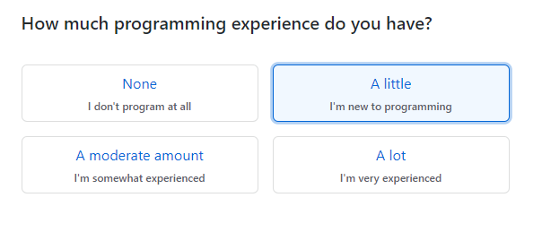   

Posteriormente, nos pregunta ¿Para qué queremos utilizar GitHub?, Podemos seleccionar hasta 3 opciones.
Entre las opciones se encuentran:

* Aprender a Programar
* Aprender Git y GitHub
* Crear un repositorio (Almacenar un projecto)

* Crear una página web con GitHub WebPages
* Para colaborar entre equipos
* Encontrar o contribuir a un proyecto open source

* Para trabajar en proyectos escolares
* Consumir el API de GitHub
* Otro

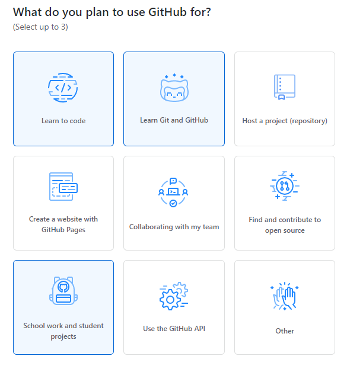  

Finalmente nos pregunta acerca de nuestros intereses, igualmente podemos escribir algunos. 
Por ejemplo: Lenguajes de programación, algún Framework o Industria.   

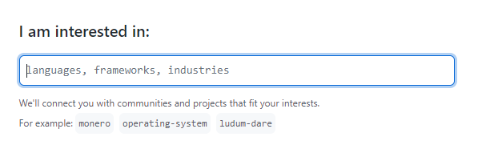  

Al dar enter nos mostrará la siguiente pantalla, informando que debemos verificar nuestra cuenta de correo.  

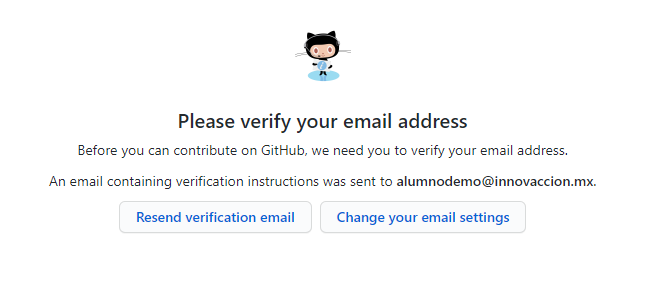  

## Verificar la Cuenta de Correo en GitHub

Para verificar nuestra cuenta de correo, debemos seguir estos pasos:

* Tendremos en nuestra bandeja de entrada un nuevo correo electrónico de GitHub le damos clic para abrirlo.    
    * 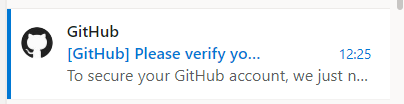  

* El correo es el siguiente, damos clic en **Mostrar contenido bloqueado**  
    * 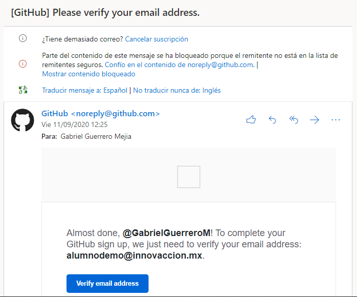  

* Clic en **Verify email address**  
    * 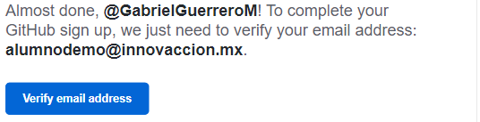  

* Automáticamente nos abrirá una nueva ventana con el mensaje de que ha sido verificada nuestra cuenta.  
    * 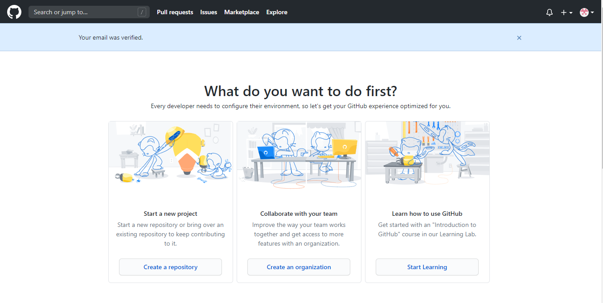  
    
* En nuestra bandeja de entrada tendremos un correo con la verificación exitosa.
    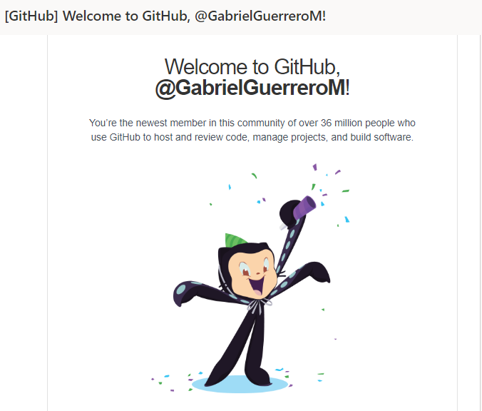  


## Activando el Student Developer Pack

Ahora que ya tenemos un correo y la cuenta de GitHub podemos aplicar para el GitHub Student Developer Pack.

* Ingresamos al siguiente link: [Aquí](https://education.github.com/discount_requests/student_application?utm_source=2020-09-14-InnovaccionVirtual)  

* Nos mandará a nuestro formulario de aplicación al GitHub Student Developer Pack
    * 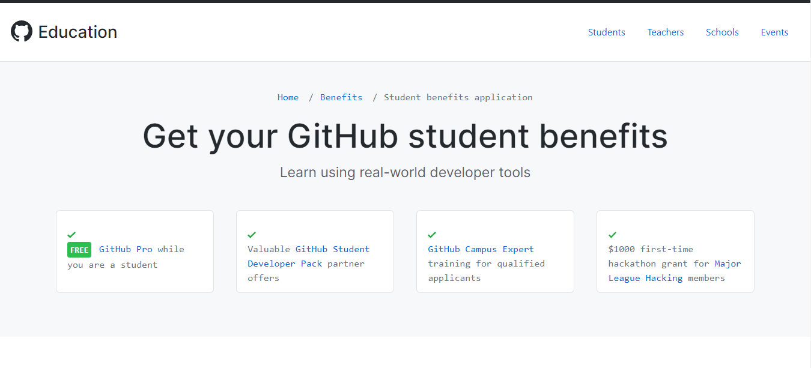  

* En donde dice "¿Cuál describe mejor su estado académico?", Selecciona **Estudiante**.
    * 
* Selecciona o añade la dirección de correo electrónico que utilizas para la escuela.
    * 

    * **Sugerencia**: seleccionar una dirección de correo electrónico emitida por la escuela, si tienes una, te da mayor probabilidad de una revisión rápida.

* Si te lo solicita, carga la prueba de tu situación académica.

    * Haz clic en **Use your camera to take a picture** (Utiliza tu cámara para sacar una foto).

    * 

    * Como alternativa, para cambiar la cámara que deseas utilizar, usa el menú desplegable de la cámara.

    * 

    * Coloca tu ID académico válido u otra prueba de tu situación académica actual en el cuadro, después haz clic en Take a picture (Sacar una foto).

    * 

    * Si no puedes sacar una foto de la prueba de tu situación académica, para cargar una imagen desde tu computadora en su lugar, haz clic en **Upload image (Cargar una imagen)**.

    * 

    * **Nota**: no se admiten archivos PDF y no puedes cargarlos como prueba de tu situación académica.

* Ingresa el nombre de tu escuela.

    * 

* Describe cómo planeas utilizar GitHub.

    * 

    
* Verifica los detalles de tu aplicación, luego haz clic en **Submit your information** (Enviar tu información).

    


Si tu solicitud es aprobada, recibirás un correo electrónico de confirmación. Las solicitudes generalmente se procesan en pocos días, pero puede llevar más tiempo durante las horas pico, así como durante el inicio de un nuevo semestre. 
    
 
    
* Recibiremos un email.Le das clic a **Otros: nuevas conversaciones**

    * 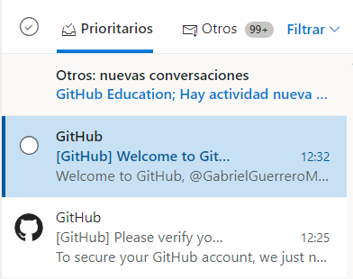  
    
* Tendremos algo así
    * 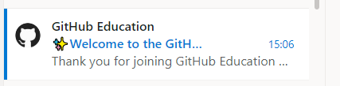  

* Abrimos el correo y con esto, hemos activado exitosamente nuestro GitHub Student Developer Pack
    * 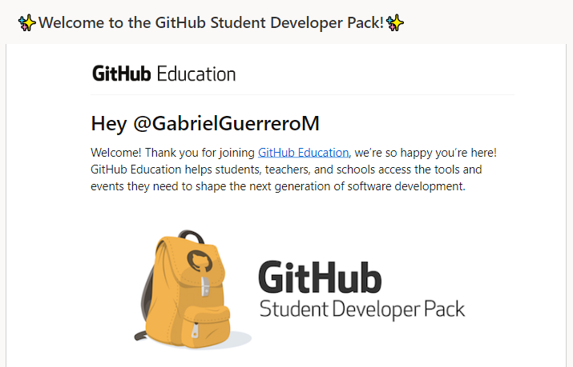  


## Ingresar a la organizacion
*Si ya formaste parte de la organización previamente, no te llegará el correo. Sólo serás parte del nuevo equipo en GitHub*

Para ser parte de la organización en GitHub, debemos hacer lo siguiente:

* Dar [Clic aquí](https://invite-innova7.herokuapp.com/) para tener la siguiente pantalla  
    * 


* Escribimos nuestro **Nombre de Usuario en GitHub** 
    * Si no sabes cuál es, [entra aquí](https://github.com) y aquí podrás encontrar el nombre de usuario que escogiste.
        * 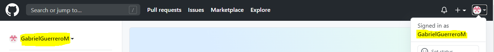    
    Ese es el nombre de usuario con el que vas a solicitar tu invitación a la organización. **SI YA ERES MIEMBRO DE LA ORG NO TE LLEGARÁ CORREO, SÓLO APARECERÁS EN UN NUEVO EQUIPO DE LA ORGANIZACIÓN**
* Seleccionamos **Invitar a la organización**  

* Nos mostrará el siguiente mensaje  
    *   
    Indicando que la invitación está en nuestra cuenta de correo de **Innovacción Virtual**
* Revisamos nuestro correo  
    *   
* El correo es como se muestra a continuación y damos clic en el link de la organización (Señalado con amarillo)  
    *   
* Ahora estaremos en la página de GitHub con la siguiente notificación, damos clic en **View Invitation**
    * 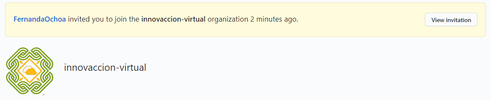
* Tenemos nuestra invitación a la organización en GitHub y sólo debemos dar clic en **Join innovaccion-virtual**
    * 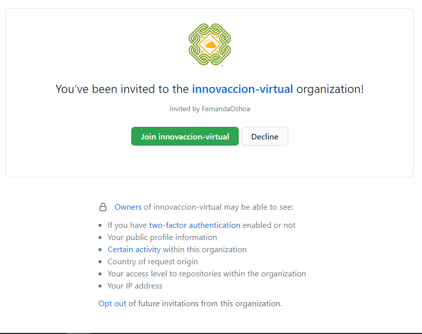
* Ahora eres miembro de la organización en GitHub
    * 
    
## Taller de GitHub 101 

### Parte 1

[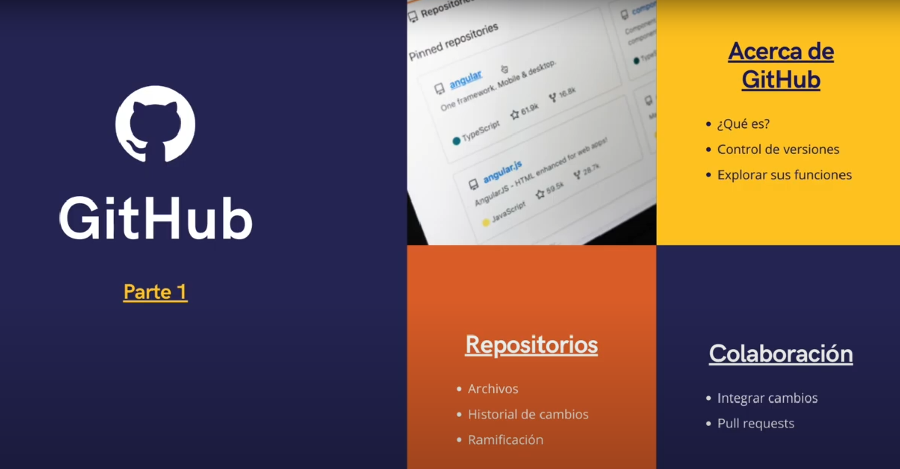](https://youtu.be/OIE9r0J1iRk "Taller de GitHub 101 parte 1")


### Parte 2

[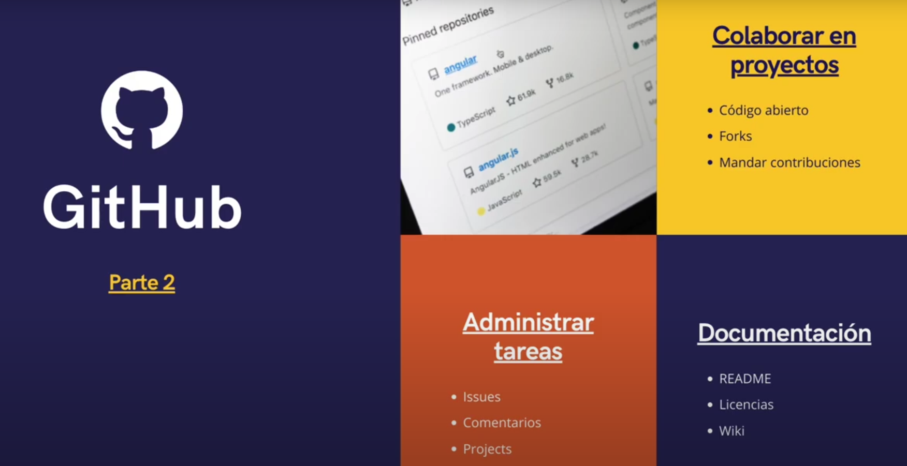](https://youtu.be/8B_qtbdlLSU "Taller de GitHub 101 parte 2")

## Conclusión del Modulo ✅

Habrás completado el módulo cuando:

- Tengas una cuenta de GitHub.
- Tengas acceso al GitHub Student Developer Pack.
- Seas parte de la organización del programa.
- Puedes consultar el [artículo oficial de GitHub aquí](https://docs.github.com/es/education/explore-the-benefits-of-teaching-and-learning-with-github-education/apply-for-a-student-developer-pack)
