# Guía para activar Microsoft Stream en Microsoft Teams

La información es válida **únicamente** para la versión web y la aplicación de escritorio.

Iniciamos sesión en Microsoft Teams con nuestra cuenta de Innovacción Virtual, posteriormente procedemos a realizar los siguientes pasos: 

* 1- Seleccionamos en el menú lateral izquierdo los 3 puntos, dónde podremos encontrar la siguiente pantalla:

    * 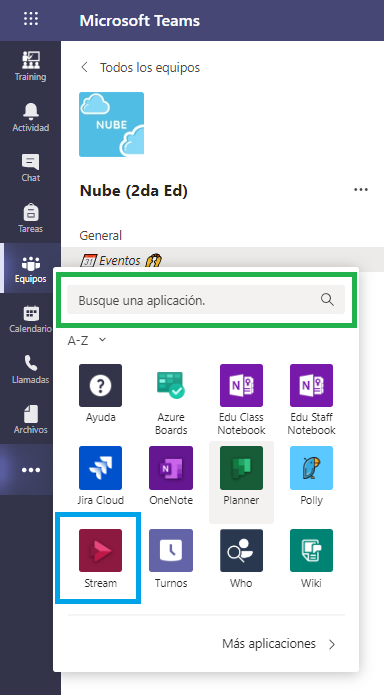  
    
    2- Podemos observar en el cuadro color **AZUL** la aplicación Microsoft Stream. Si no logras visualizarla, en el recuadro señalado color **VERDE** escribimos ```Stream```  
        
        * Seleccionamos la primera opción, señalada en el recuadro **VERDE**  
        
        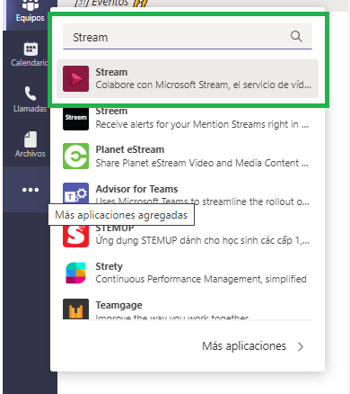  
        
    * 3- Ahora seleccionamos el ícono de Stream, señalado en el recuadro color **ROJO** 
        * 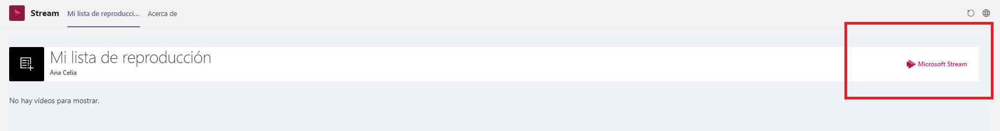  
    * 4- Nos abrirá una nueva pestaña o bien una pestaña en el navegador como se muestra a continuación
        * 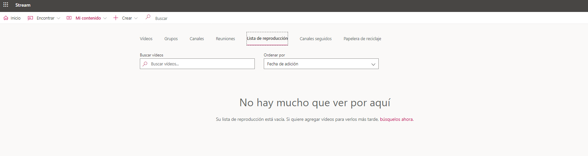  
    * 5- Seleccionamos la opción **MI CONTENIDO** señalada en el recuadro color **ROJO**, seguido de la opción **GRUPOS** señalada en color **VERDE**
        * 
    * 6- En la pantalla se mostrarán los equipos disponibles, en nuestro caso seleccionamos **NUBE**
        * 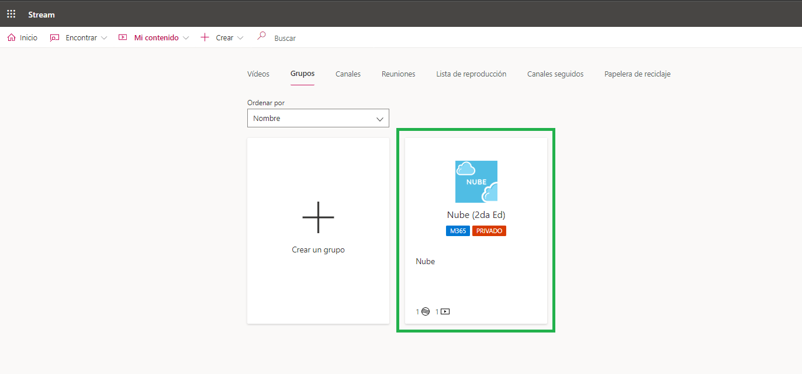
    * 7- Ahora podemos encontrar las grabaciones de los eventos en directo que tenemos disponibles. 
        * 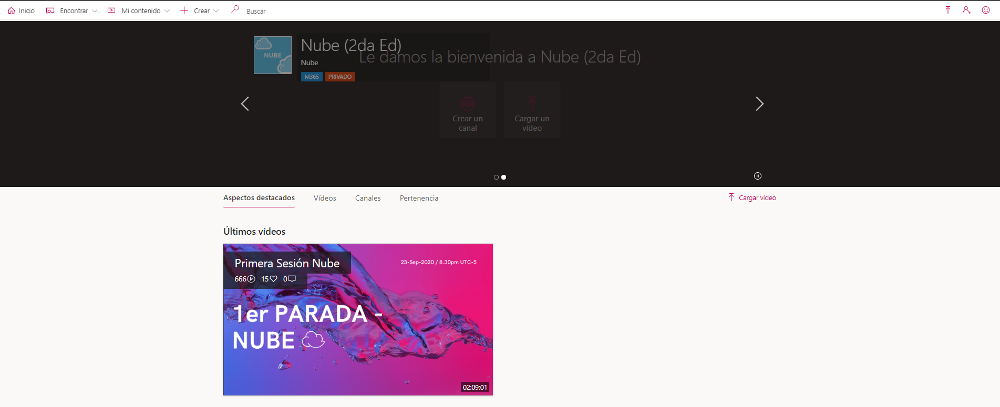
    * 8- Al colocar el mouse por encima de la imagen (SIN HACER CLIC, SOLAMENTE COLOCÁNDOLO ENCIMA DEL VIDEO) podemos ver la opción **Agregar a la lista de reproducción**, señalado de color **AMARILLO**.
        * 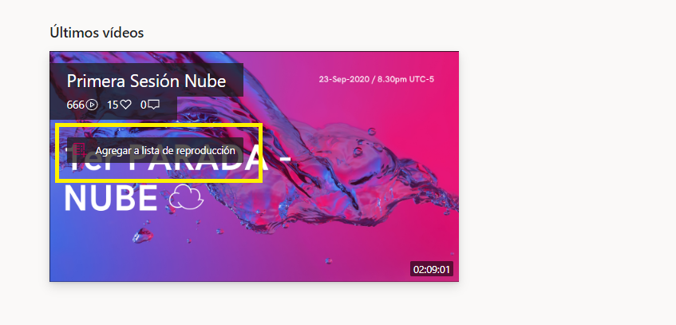
    * 9- Le damos clic en **AGREGAR A LA LISTA DE REPRODUCCIÓN** y deberá aparecer de la siguiente manera, con la etiqueta **Quitar de la lista de reproducción** señalada en color **AMARILLO**
        * 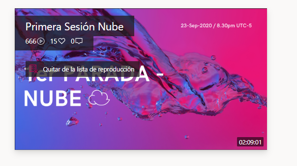  
    * 10- Regresamos a Microsoft Teams y seleccionamos la opción recargar en la esquina superior derecha, señalada de color **VERDE**
        * 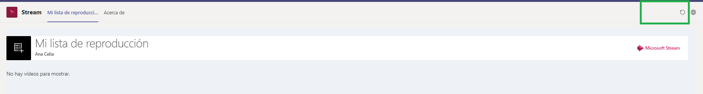
    * 11- Ahora podemos visualizar el vídeo en Microsoft Teams
        * 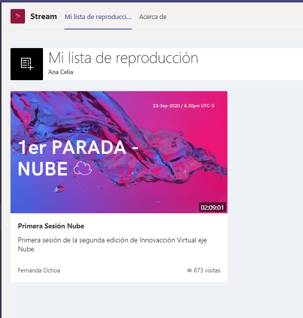

* 12- Finalmente fijamos nuestra aplicación en el menú lateral izquierdo de Teams. 

    * Basta con dar **CLIC DERECHO** en el recuadro de Stream, señalado con color **ROJO** y dar **CLIC NORMAL** en la opción **ANCLAR**
        * 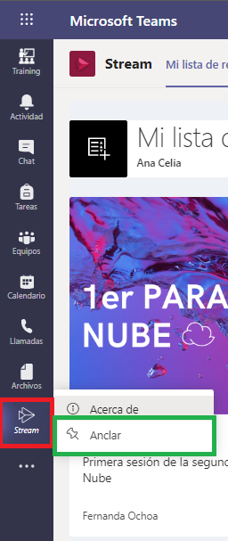
        
Listo, hemos configurado nuestro canal para poder ver las transmisiones que queden grabadas, si queremos agregar más vídeos, debemos agregarlos a la lista de reproducción (Repetir los pasos del número 3 en adelante). 