# Guía para utilizar los beneficios del GitHub Student Developer Pack

A continuación encontraremos los pasos a seguir para poder aprovechar los beneficios que otorga el GitHub Student Developer Pack.

* [Iniciamos sesión en GitHub](https://github.com/login) con nuestra cuenta que registramos para el GitHub Student Developer Pack. 
    * 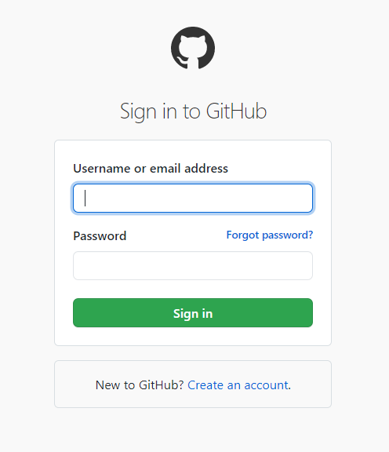  

* Después ingresamos a la siguiente [liga](https://education.github.com/pack/offers) que nos llevará aquí.
    * 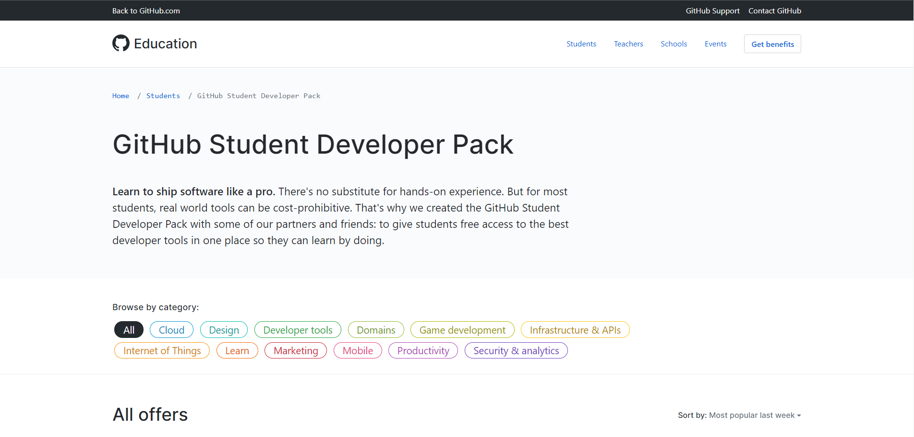 
    
* Navegamos hacia abajo (Scroll up) y podemos visualizar los beneficios disponibles.
    * 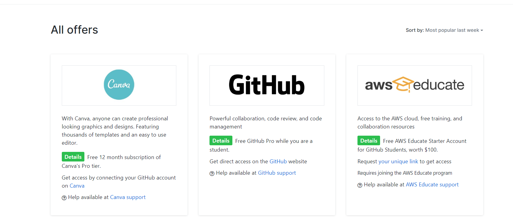

Para este ejercicio seleccionaremos CANVA, un editor de imágenes y videos que nos ayudará a comunicar nuestras ideas de mejor manera, entre muchas cosas más.

Lo primero es tener una cuenta en CANVA, si ya la tienes puedes saltarte estos pasos, sino debemos crear una.
## Creando una cuenta de CANVA
* Ingresamos a [Canva.com](https://www.canva.com/)
    * Clic en **Sign up with email** señalado en color **ROJO**
        * 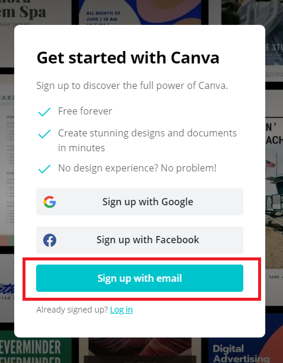
    * Ingresamos nuestra información y clic en **Get Started, it's free!** señalado en color **ROJO**
        * 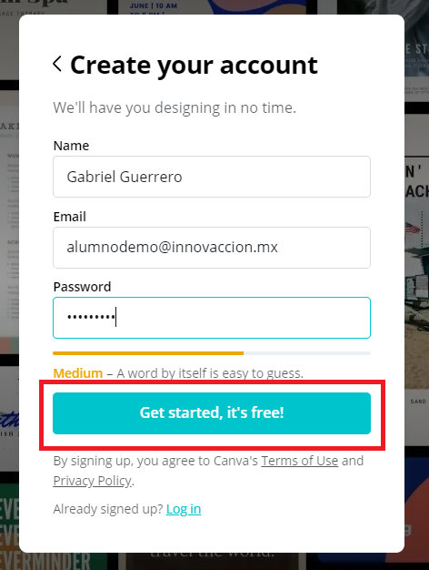  
    * Seleccionamos la opción **Estudiante/Student** señalada en color **ROJO**
        * 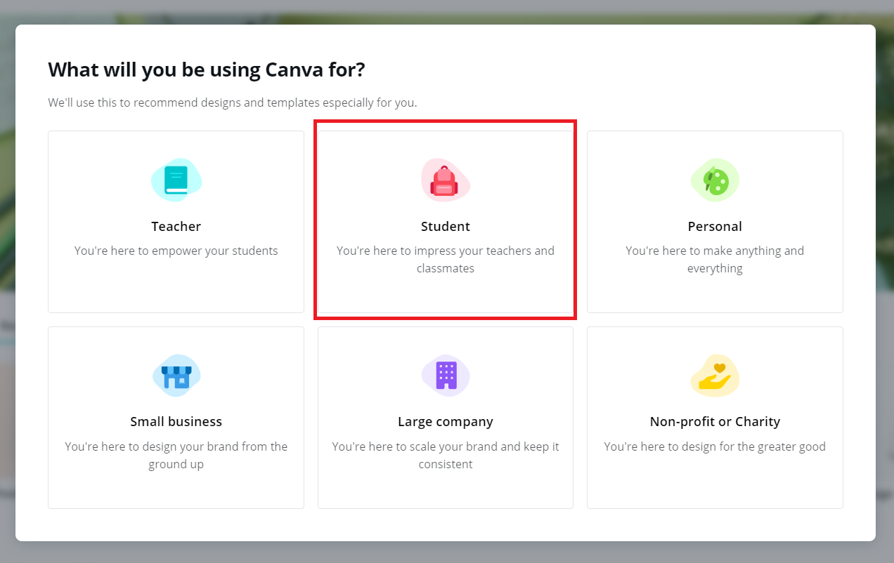 
    * Damos clic en **Skip** señalado en color **ROJO**
        * 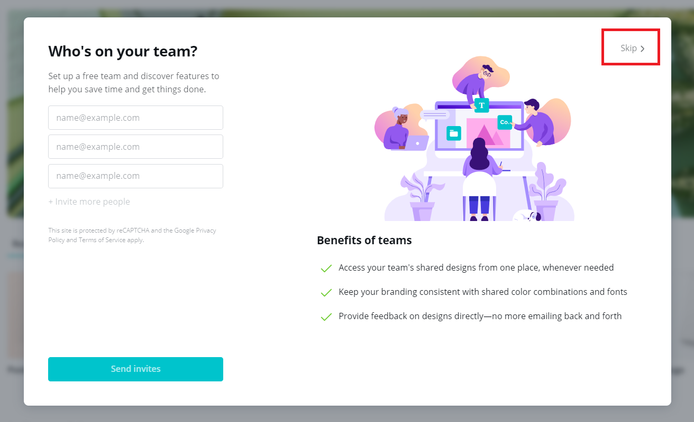 
    * Ahora seleccionamos el diseño con el que queremos iniciar, la verdad no importa, para este ejemplo seleccionaré **Infografía** 
        * 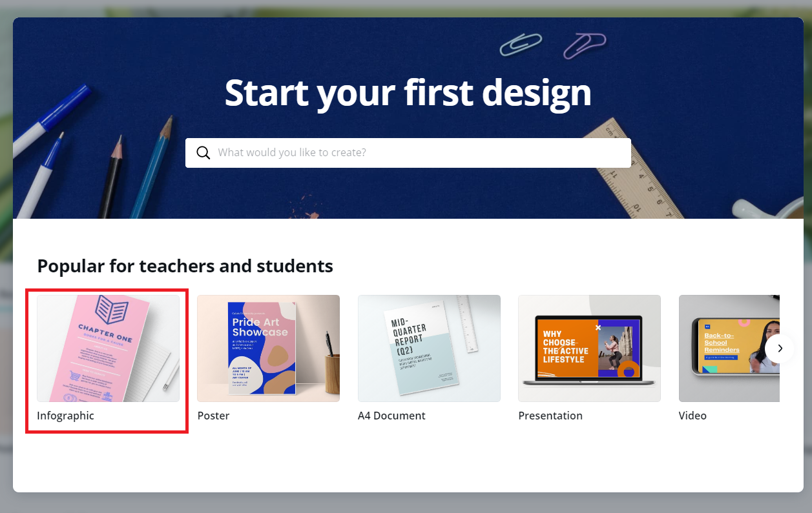
    * Listo tenemos creada y configurada nuestra cuenta de CANVA Gratuita
        * 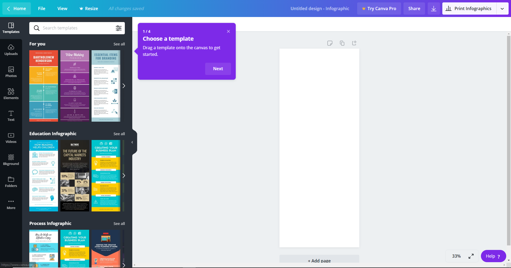
    * Para activar la versión PRO coninúa el tutorial.  
    
## Activando la versión PRO de CANVA
* Para ello damos clic en el link señalado en el recuadro color **ROJO**
     * 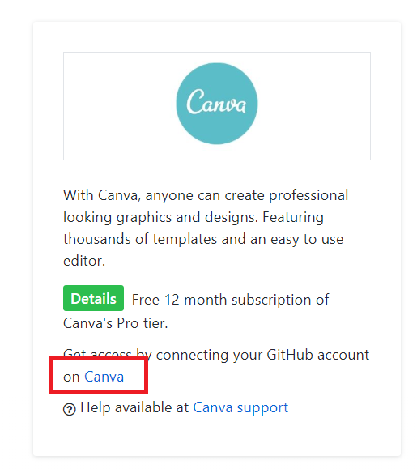 
    
    * Nos llevara a la siguiente pantalla y seleccionamos **Iniciar Sesión** señalada en color **ROJO**
        *  
    * Ingresamos los datos de nuestra cuenta en canva, incluso si es otra cuenta que ya tenías en canva.
        * 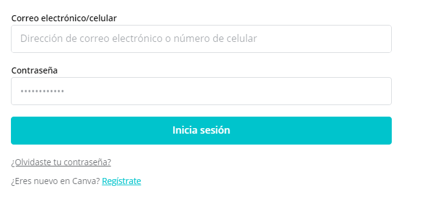
    * Clic en **Incia sesión** señalado en color **ROJO**
        * 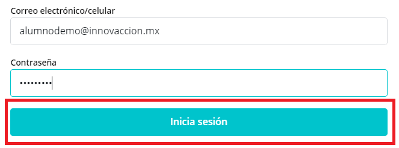
    * Ahora nos pedirá iniciar sesión con nuestra cuenta en GitHub, la que tiene el GitHub Student Developer Pack. Seleccionamos **Sign up with GitHub** señalado en color **ROJO**
        * 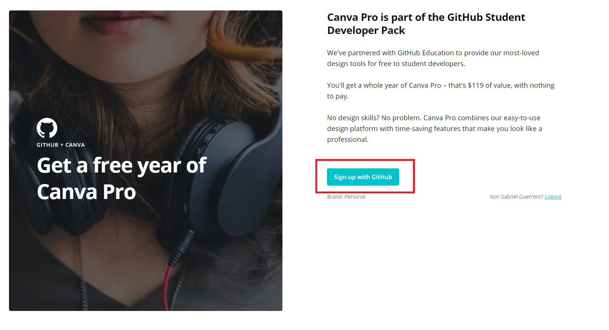 
    * Abrirá una ventana emergente para solicitar una confirmación de acceso, damos clic en **Authoriza Canva** señalado en color **ROJO**
        * 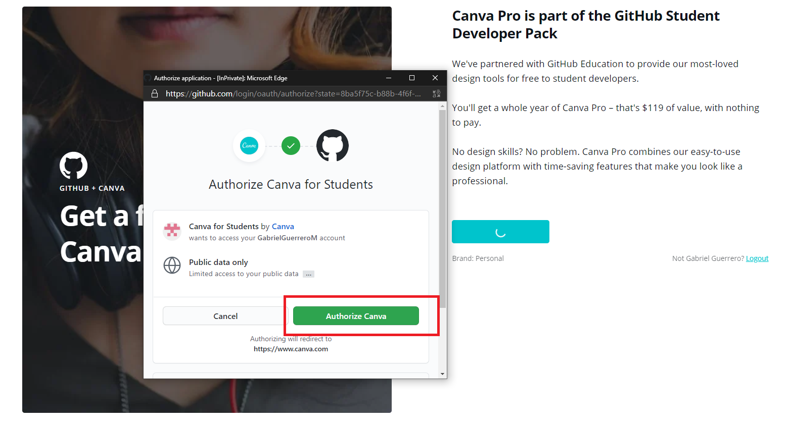 
    * Enseguida nos confirmará que ha sido activada nuestra versión PRO de Canva, como se muestra a continuación:
        * 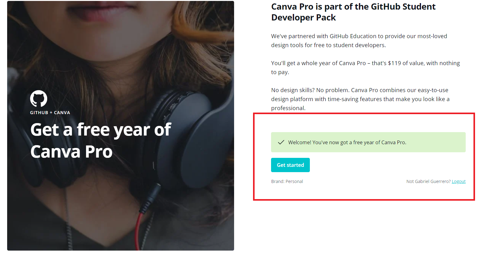
    * Ingresamos a [Canva](https://canva.com) y podremos darnos cuenta que las funciones PRO ya han sido habilitadas.
        * 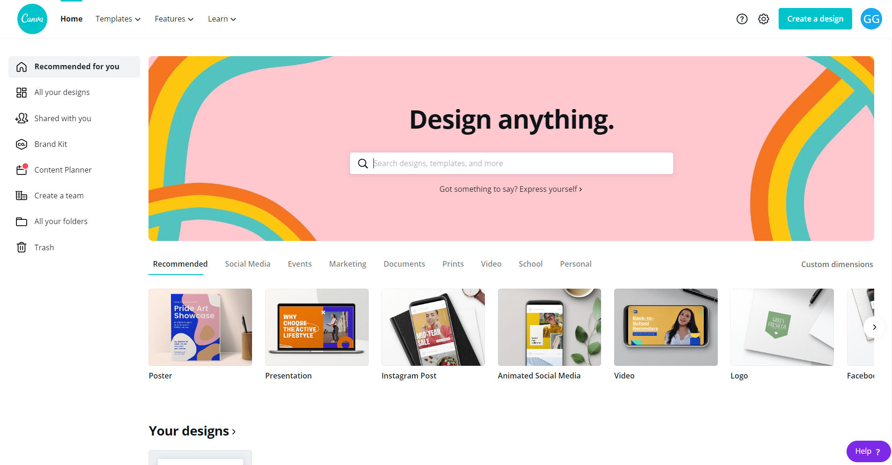
        
Hemos creado una cuenta en canva y activado uno de los beneficios de nuestro GitHub Student Developer Pack.
Un tutorial les doy, por que su Sherpa Fernanda Ochoa soy <3.
